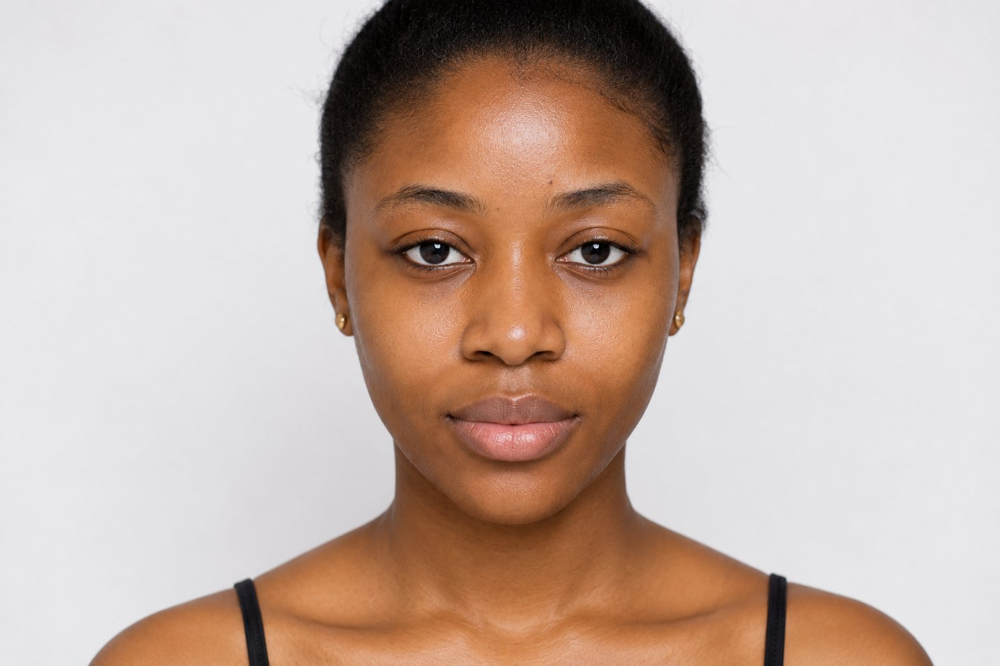
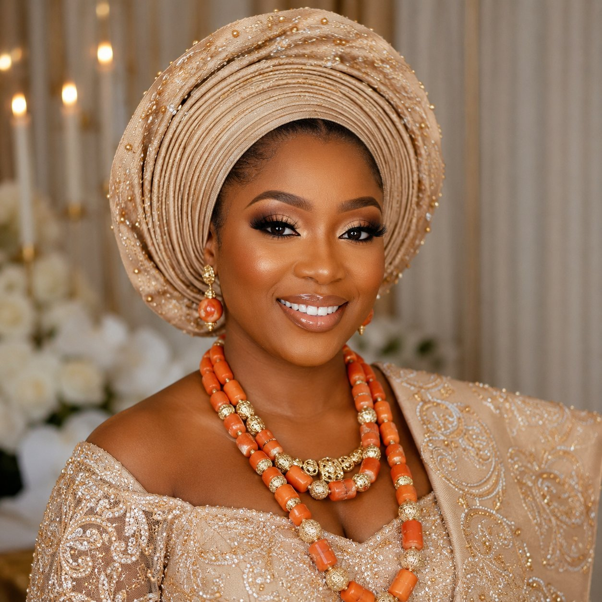

# Before/After Gallery Fix — Static Paired Cards

**Project:** Veloura Beauty Studio  
**Scope:** Transformation gallery cards on `index.html` only  
**Date:** May 2026

---

## Why the draggable comparison slider was removed

The previous implementation used a **vertical split compare slider** (range input, drag handle, overlapping before/after layers). That pattern only works when:

- Before and after photos share the **same pose, angle, crop, and lighting**
- Faces or subjects align pixel-perfect on the split line

Veloura’s assets are **authentic paired shots** from different sessions. Subjects differ in framing, head angle, and lighting. Dragging a split line across mismatched pairs looked awkward and unprofessional—exposing misalignment instead of showcasing results.

---

## Why static paired cards are better

| Compare slider | Static Before + After panels |
|----------------|------------------------------|
| Implies identical framing | Honest “then → now” story |
| Misalignment is obvious | Each image stands on its own |
| Extra JS + accessibility complexity | Simple, fast, accessible |
| Single cropped viewport | Full visibility of both states |

This matches **Instagram carousel / editorial lookbook** habits: two clear images with labels, not a gimmick slider.

---

## What changed

| File | Changes |
|------|---------|
| `index.html` | Replaced 6× `ba-compare` blocks with `ba-pair` two-panel layout; fixed caption encoding (`—`) |
| `css/style.css` | Removed compare-slider styles; added `.ba-pair` grid layout and labels |
| `js/gallery.js` | Removed compare slider init; **category filters unchanged** |

**Unchanged:** Trust bar, filter pills, captions, hashtags, CTA bar, Instagram grid, `data-gallery-category` values, WOW classes.

---

## How the new layout works

### HTML structure (per card)

```html
<div class="ba-pair" role="group" aria-label="Bridal glam before and after">
  <figure class="ba-pair__panel ba-pair__panel--before">
    <span class="ba-pair__label">Before</span>
    
  </figure>
  <figure class="ba-pair__panel ba-pair__panel--after">
    <span class="ba-pair__label">After</span>
    
  </figure>
</div>
```

- **Left:** Before (desktop)  
- **Right:** After (desktop)  
- Labels: dark chip (Before), gold chip (After)  
- Thin gold gutter between panels (grid `gap` on cream/gold background)

### CSS behaviour

- **Desktop / tablet (≥576px):** `grid-template-columns: 1fr 1fr` — equal columns, shared row height via `aspect-ratio` on panels  
- **Mobile (&lt;576px):** Single column stack — Before on top, After below (readable, no cramped side-by-side)  
- **Images:** `object-fit: cover`; makeup/skincare use `center top` for faces; nails use `center` for hands  

### JavaScript

`gallery.js` only toggles `.is-hidden` on `.transform-ba-item` when filter buttons are clicked. No slider logic remains.

---

## Category filters (still working)

| Button | `data-gallery-filter` |
|--------|------------------------|
| All Transformations | `all` |
| Hair | `hair` |
| Wig Installs | `wig-installs` |
| Makeup | `makeup` |
| Nails | `nails` |
| Skincare | `skincare` |

---

## How to replace before/after images

1. Add JPEGs to `img/ba/` using existing names:

   | Card | Before | After |
   |------|--------|-------|
   | Bridal Glam | `bridal-before.jpg` | `bridal-after.jpg` |
   | Frontal Install | `frontal-before.jpg` | `frontal-after.jpg` |
   | Luxury Facial | `facial-before.jpg` | `facial-after.jpg` |
   | Signature Nails | `nails-before.jpg` | `nails-after.jpg` |
   | Event Makeup | `event-before.jpg` | `event-after.jpg` |
   | Hair Colour | `colour-before.jpg` | `colour-after.jpg` |

2. Keep **similar aspect ratio** (portrait 3:4 works well on desktop).  
3. No HTML change required if filenames stay the same.  
4. See `IMAGE_INTEGRATION.md` for source asset folders.

**Tip:** For best results, shoot before/after with consistent lighting—but display as **paired cards**, not a slider, unless alignment is studio-controlled.

---

## Mobile optimization

- Stacked layout prevents tiny side-by-side crops on narrow screens  
- `aspect-ratio: 4 / 3` on stacked panels for comfortable height  
- `loading="lazy"` preserved  
- Card hover lift disabled on touch (existing polish layer)  

---

## Remaining recommendations

- Replace `massage.jpg` service image when a dedicated asset exists (unrelated to this gallery)  
- Optional: add subtle “→” between panels on desktop only (CSS `::after`)—not added to avoid scope creep  
- Update legacy `BEFORE_AFTER_GALLERY.md` when editing that file for historical accuracy  

---

*Related: `IMAGE_INTEGRATION.md` (asset mapping), `BEFORE_AFTER_GALLERY.md` (original feature spec).*
