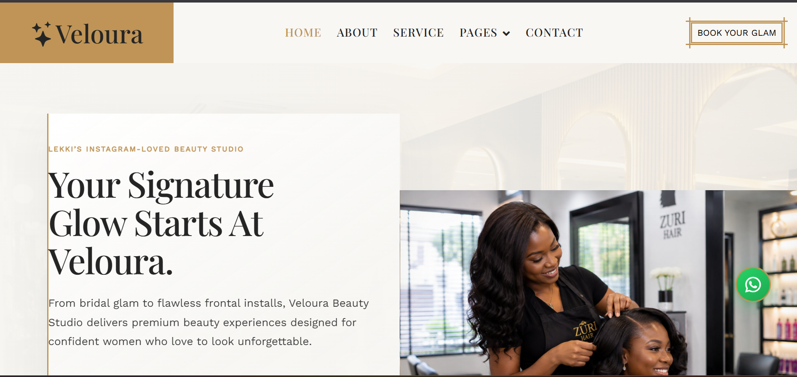
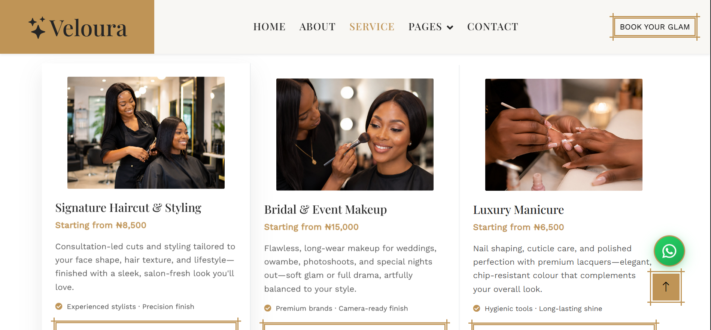
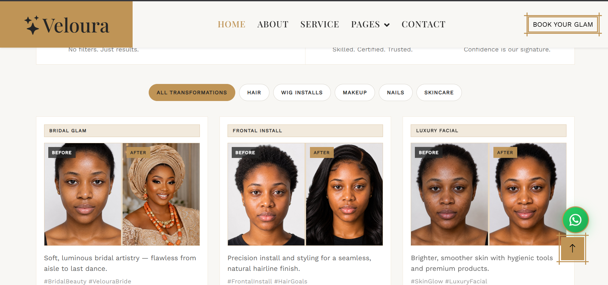
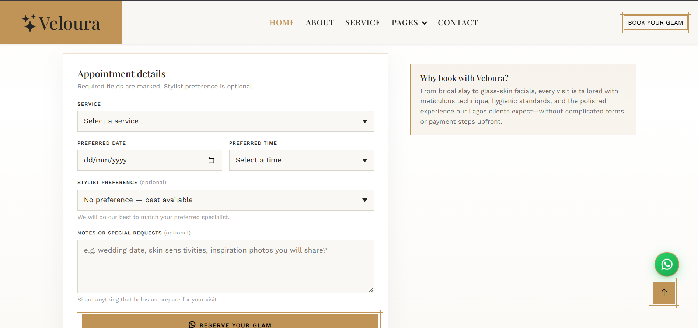
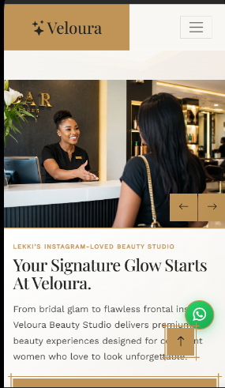

# Veloura Beauty Studio

**A conversion-focused luxury beauty salon website for modern Nigerian glam brands.**

[](https://velourastudio.pages.dev)
[](https://github.com/destine2/salon)

**Live demo:** [https://velourastudio.pages.dev](https://velourastudio.pages.dev)  
**Repository:** [https://github.com/destine2/salon](https://github.com/destine2/salon)

---

## Overview

Veloura Beauty Studio is a **customized, portfolio-ready salon website** built to help Nigerian beauty businesses turn visitors into bookings. It combines a premium visual identity, clear pricing, social proof, and a **WhatsApp-first appointment flow**—optimized for how clients in Lagos and similar markets actually book glam services.

This is **not** a generic theme drop-in. The project started from the free **Salone** HTML template by [HTML Codex](https://htmlcodex.com/beauty-salon-website-template) and was **extensively customized** into a branded, conversion-focused system for Veloura (copy, layout refinements, booking logic, gallery, trust blocks, mobile UX, and QA). Original template attribution is retained per the license (see [License & attribution](#license--attribution)).

**Target market:** Nigerian beauty salons, glam studios, bridal makeup artists, wig/frontal installers, nail studios, and skincare boutiques that want a polished online presence without a heavy CMS.

---

## Business problem

Many salon sites look dated, hide prices, and force clients to DM blindly—leading to drop-off, slow replies, and weak trust before the first visit.

Veloura addresses this by:

- Presenting **services and packages with clear starting prices**
- Guiding users to **book via WhatsApp** with structured, pre-filled messages
- Building confidence through **before/after work, testimonials, and team visibility**
- Staying **fast and readable on mobile**, where most beauty discovery happens in Nigeria

---

## Key features

| Area | What it does |
|------|----------------|
| **WhatsApp booking** | Validated form opens `wa.me` with service, date, time, stylist preference, and notes |
| **Pricing psychology** | Package cards with primary/reserve/chat CTAs and deep links (`?service=`) |
| **Transformation gallery** | Category filters + before/after pairs for bridal, hair, nails, skin, events |
| **Trust systems** | Testimonials, team portraits, local contact (map, hours, phone), service trust notes |
| **Premium UX** | Editorial hero, gold/cream brand palette, refined inner-page banners |
| **Mobile-first** | Responsive grid, touch-friendly CTAs, collapsible nav, floating WhatsApp button |
| **No backend required** | Static HTML/CSS/JS—easy to host on GitHub Pages, Cloudflare Pages, Netlify, etc. |

---

## Technologies used

- **HTML5** — Semantic structure, accessibility labels, UTF-8 copy
- **CSS3** — Custom design system in `css/style.css` (Bootstrap base retained)
- **JavaScript (ES5-style)** — jQuery for DOM and carousels
- **Bootstrap 5** — Grid, components, responsive utilities
- **Owl Carousel** — Hero slider and testimonial carousel
- **WOW.js / Animate.css** — Scroll animations
- **Font Awesome & Bootstrap Icons** — UI icons
- **Google Fonts** — Dancing Script, Playfair Display, Work Sans

---

## Website sections

### Pages

| Page | Path | Purpose |
|------|------|---------|
| Home | `index.html` | Hero, about, services, pricing, transformations, portfolio grid, team, testimonials, booking, contact |
| About | `about.html` | Brand story + team preview |
| Services | `service.html` | Full service grid + CTAs |
| Contact | `contact.html` | Booking form + visit/map |
| Team | `team.html` | Stylist roster |
| Client stories | `testimonial.html` | Social proof carousel |
| 404 | `404.html` | Friendly error page |

### Homepage sections (index)

1. Sticky navigation + **Book Your Glam** CTA  
2. Editorial hero with image carousel  
3. About + phone/WhatsApp strip  
4. Service cards (6 treatments)  
5. Premium pricing packages  
6. Before/after transformation gallery  
7. Instagram-style portfolio grid  
8. Team members  
9. Testimonials carousel  
10. WhatsApp booking form  
11. Local trust / map / hours  
12. Footer + floating WhatsApp  

---

## Screenshots

The screenshots below highlight the main conversion-focused sections of the Veloura Beauty Studio website.

### Homepage Hero



### Services & Pricing



### Transformation Gallery



### Booking Form



### Mobile View



---

## Local development

No build step. Clone and open `index.html`, or serve the folder:

```bash
git clone https://github.com/destine2/salon.git
cd salon
python -m http.server 8080
# Visit http://localhost:8080
```

**Booking scripts:** `js/booking.js` (form → WhatsApp), `js/gallery.js` (gallery filters), `js/veloura-map.js` (map URLs), `js/main.js` (carousels, UI).

**Project docs** (implementation notes): `FINAL_QA_REPORT.md`, `BRAND_IDENTITY.md`, `BOOKING_SYSTEM.md`, `TEXT_ENCODING_CLEANUP.md`, and others in the repo root.

---

## What I learned

- How to turn a **free HTML template** into a **branded product** without breaking license terms or overstating authorship  
- Designing **WhatsApp-native booking** for markets where chat beats long forms  
- Using **pricing cards, trust bars, and transformation galleries** to reduce booking friction  
- Fixing **real-world front-end issues**: encoding/punctuation, carousel autoplay, form `preventDefault`, map embed URLs, and mobile layout edge cases  
- Running a **structured QA pass** (text, CTAs, images, a11y basics, SEO) before portfolio delivery  

---

## Future improvements

- [ ] Add final screenshot assets to the README  
- [ ] Replace placeholder Google Maps embed with verified Business Profile embed  
- [ ] Expand team roster (unique profiles for all cards on `team.html`)  
- [ ] Optional: lightweight CI (HTML validation, link check) on push  
- [ ] Optional: PWA manifest + offline shell for repeat visitors  
- [ ] Client-specific fork: multi-location support, deposit/payment links, Instagram feed API  

---

## Demo business details

_Fictional portfolio brand — for demonstration._

| | |
|---|---|
| **Studio** | Veloura Beauty Studio |
| **Location** | 14 Admiralty Way, Lekki Phase 1, Lagos, Nigeria |
| **Phone / WhatsApp** | +234 811 271 1466 |

---

## License & attribution

### Template

This project is based on the free **Salone – Beauty Salon Website Template** by **[HTML Codex](https://htmlcodex.com)**:

- Template: [Beauty Salon Website Template](https://htmlcodex.com/beauty-salon-website-template)  
- License: [HTML Codex Free Template License](https://htmlcodex.com/license) (see also `LICENSE.txt` in this repository)

Under that license, the template may be customized for personal and commercial use, but **the author’s credit/attribution must not be removed** where required. This repository retains appropriate attribution to HTML Codex. **The full original template was not built from scratch**—it was modified, rebranded, and extended with custom JavaScript, content, imagery integration, and conversion-focused sections.

### This repository

Custom code, Veloura brand content, documentation, and integrated assets added during customization are part of this portfolio project. Do not resell the HTML Codex template itself; refer to `LICENSE.txt` for full terms.

---

## Connect

- **Live site:** [velourastudio.pages.dev](https://velourastudio.pages.dev)  
- **Source:** [github.com/destine2/salon](https://github.com/destine2/salon)  

If this project helps you or your salon brand, consider starring the repository.
