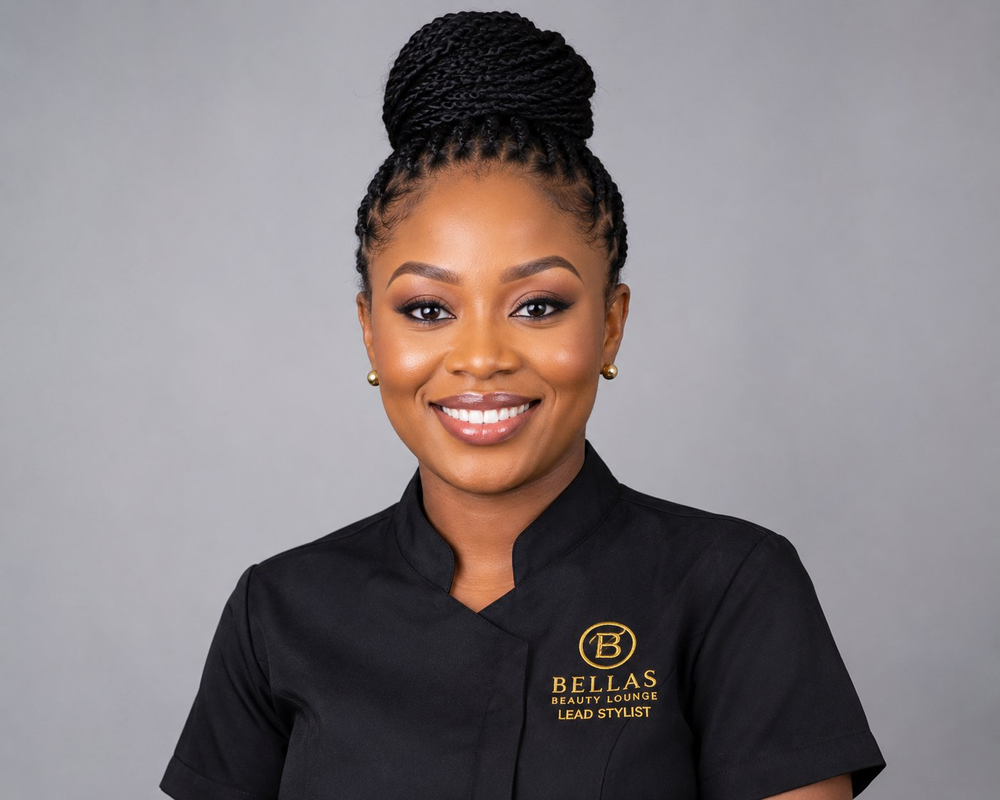

# Team Members Section — Display Fix

Documentation for the Veloura Beauty Studio team card layout update applied to `index.html`, `about.html`, and `team.html`.

---

## What was wrong (previous overlay layout)

The original template used a **`.team-item`** structure with a **`.team-overlay`** panel positioned absolutely over the portrait (`bottom: 30px; left/right: 30px`). On hover, the overlay expanded to a semi-opaque white block.

That caused several problems:

1. **Role, name, and social buttons sat on top of the face**, obscuring the stylist in the hero area of each card.
2. **Multiple social icons** (Facebook, Twitter, Instagram, etc.) used placeholder `#` or broken URLs, adding clutter.
3. **Hover-dependent readability** — details were harder to scan without hovering.
4. **Inconsistent cropping** — full-height images scaled on hover (`scale(1.2)`) without a fixed frame, so faces could shift or feel cropped awkwardly.

The section looked busy and unprofessional for a luxury salon brand.

---

## What was changed

### HTML structure (Option A — details below the portrait)

Each member is now a semantic **`<article class="team-card">`** inside a Bootstrap column. The row uses **`team team--premium`** so new styles apply without affecting legacy overlay rules elsewhere.

```html
<article class="team-card">
  <div class="team-card__media">
    
  </div>
  <div class="team-card__body">
    <p class="team-card__role">Hair Specialist</p>
    <h3 class="team-card__name">Amara Okonkwo</h3>
    <div class="team-card__social">
      <a class="team-card__social-link" href="https://instagram.com/velourabeautystudio" ... aria-label="Follow Amara Okonkwo on Instagram at Veloura Beauty Studio">
        <i class="fab fa-instagram" aria-hidden="true"></i>
      </a>
    </div>
  </div>
</article>
```

### CSS (`css/style.css`)

New block: **`.team--premium`** (see comment `TEAM_SECTION_FIX.md` near line ~987).

- White card, gold-tinted border, soft shadow, subtle lift on hover (desktop).
- Portrait in **`.team-card__media`**; copy and social in **`.team-card__body`** below the image.
- Legacy **`.team-overlay`** rules remain for backward compatibility but are unused on updated pages.

### Social links

- Removed broken multi-network buttons.
- **Single Instagram link** per card: `https://instagram.com/velourabeautystudio` (studio account; safe until per-stylist URLs exist).
- **`target="_blank"`**, **`rel="noopener noreferrer"`**, and **descriptive `aria-label`** on each link.

### Pages updated

| File        | Cards |
|------------|-------|
| `index.html` | 4 |
| `about.html` | 4 |
| `team.html`  | 8 (two rows of four; same four specialists repeated) |

HTML comments at section start point here: `<!-- Team Start: premium cards below portrait — see TEAM_SECTION_FIX.md -->`

---

## How the new card structure works

```
┌─────────────────────────┐
│  .team-card__media      │  ← fixed aspect ratio, overflow hidden
│  [ portrait image ]     │
├─────────────────────────┤
│  .team-card__body       │  ← flex column, centered text
│  ROLE (gold caps)       │
│  Name (Playfair)        │
│  [ Instagram icon ]     │
└─────────────────────────┘
```

- **`.team--premium .col-md-6.col-lg-3`** uses `display: flex` so all cards in a row share **equal height**.
- **`.team-card`** is `flex-direction: column; height: 100%` so the body fills remaining space evenly.
- The gold **`.team::before`** band still runs behind the row for brand continuity; cards sit above it (`z-index: 1`).

---

## How image cropping is handled

| Property | Value | Purpose |
|----------|--------|---------|
| `aspect-ratio` | `3 / 4` (desktop), `4 / 5` (mobile) | Consistent frame |
| `max-height` | `320px` on desktop media | Aligns card tops |
| `object-fit` | `cover` | No stretching |
| `object-position` | `center top` | Keeps faces in frame |
| `overflow` | `hidden` on media | Clean edges |
| Hover | Slight `scale(1.03)` on desktop only | Premium motion without covering faces |

To favor a different crop (e.g. full-body shots), adjust **`object-position`** on `.team--premium .team-card__img` (e.g. `center 20%`) in `css/style.css`.

---

## Mobile responsiveness

- **Breakpoints:** `col-md-6` → two columns from tablet; single column on small phones.
- **Taller aspect ratio** on small screens (`4 / 5`) for clearer portraits.
- **Hover lift and image zoom disabled** under `767.98px` to avoid jank on touch devices.
- **Social icons stay in `.team-card__body`** — never over the portrait.

---

## Replacing team portraits in the future

1. **Prepare images:** Portrait orientation, minimum ~800×1000 px, JPG recommended, faces in the upper third.
2. **File names:** Keep existing paths for drop-in replacement:
   - `img/team-1.jpg` — Amara Okonkwo (Hair)
   - `img/team-2.jpg` — Zainab Hassan (Nails)
   - `img/team-3.jpg` — Temitope Adeyemi (Beauty)
   - `img/team-4.jpg` — Ngozi Eze (Spa)
3. **Update `alt` text** in each `` to match the person and role.
4. **Update copy** in `.team-card__role` and `.team-card__name` if names or titles change.
5. **Optional:** Add a fifth member by duplicating a column block in the row and adding CSS only if you need a fifth column layout (e.g. custom grid).

To add a **personal Instagram URL**, change the `href` on that member’s `.team-card__social-link` and update the `aria-label`.

---

## Maintenance notes

- Do not reintroduce **`.team-overlay`** on `.team--premium` rows unless you switch to a minimal bottom gradient (Option B) that does not cover the face.
- When copying a card, keep **image `src` / `alt` / role / name** aligned (see `team.html` row 2 fix).
- Styles live in one place: **`.team--premium`** in `css/style.css`.

---

*Veloura Beauty Studio — Team section display fix.*
